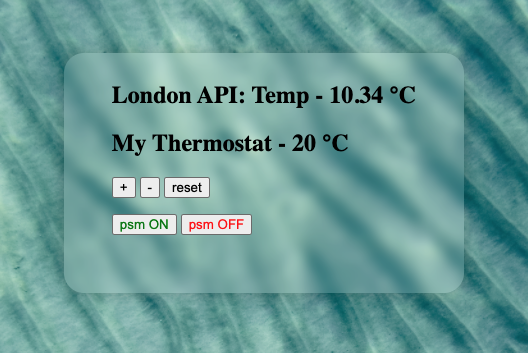

# Thermostat

A simple thermostat where users can interact to change temperatures and add desired weather APIs.




####Setup

From command line:
```
git clone git@github.com:Joshuamac2/Thermostat.git
cd Thermostat
bundle
open index.html
```

####Customer's requirements:

```
as user
so my temperature is controlled
I want to increase or decrease my temperature

as user
so i can have my ideal temperature
I want to a base temperature of 20

as user
so my temperature is never below or above desired temperature
I would like my Thermostat to not go below 10 or above 32 degrees

as user
so i can save on my bills
I would like a power saving mode on by default

as user
so i can reset temperature to base
I would like a reset button

as user
so i so i can see its current energy usage
I would like indication of usage with colours

as user
so i know the temperature outside
I would like the temperature of London    
```

####Tech
- Javascript
- Jquery
- Jasmine
- HTML/CSS
